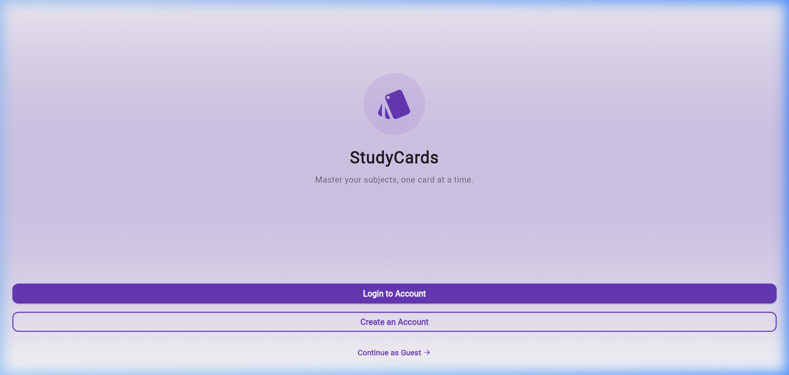
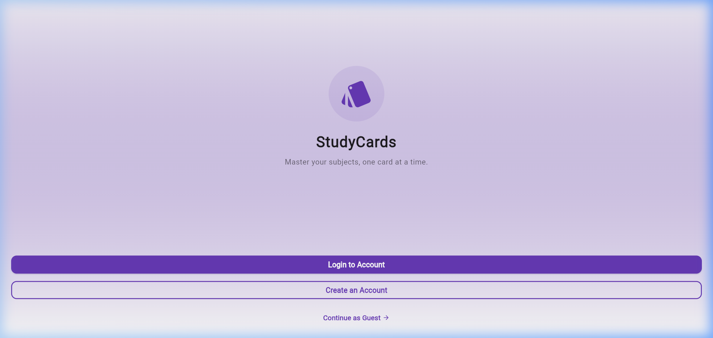
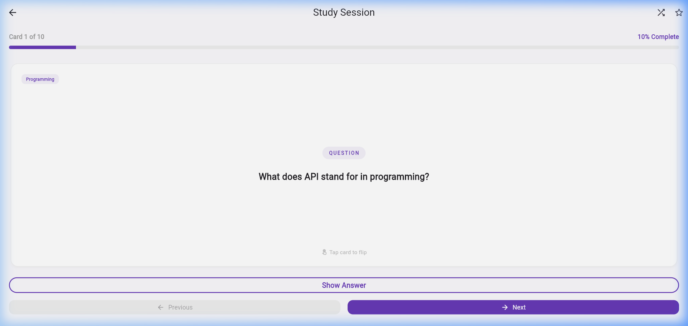
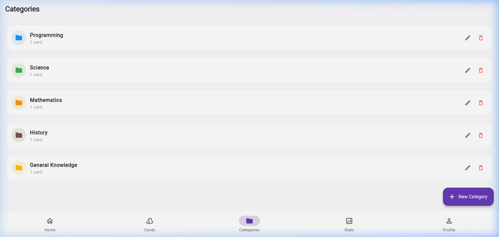
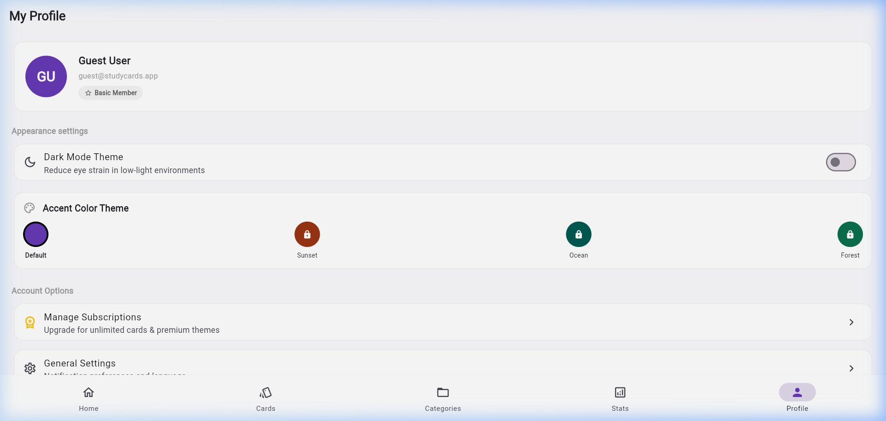
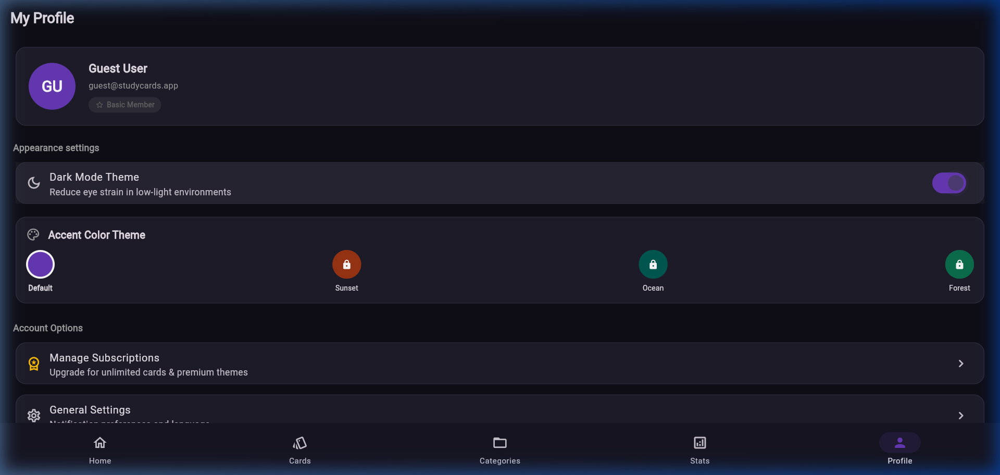

# 📚 StudyCards

**Flutter** • **Dart** • **Material Design 3** • **Google Gemini AI**

A modern, premium, and feature-rich Flutter flashcard learning application developed to help students study more effectively. StudyCards enables users to create, organize, and review custom flashcards with a clean interface, local data storage, multi-state authentication, dynamic AI card generation, study stats tracking, and customizable color schemes.

This project was built and fully polished as a submission for the **CodeAlpha Internship** program.

---

# 📱 App Highlights & UI Preview

| Welcome Screen | Home Screen | Flashcard Study |
| :---: | :---: | :---: |
|  |  |  |

| Categories | Profile | Dark Mode |
| :---: | :---: | :---: |
|  |  |  |

---

# 📊 Codebase & Localization Languages

### 💻 Development Languages Used
The repository is composed of the following programming and configuration languages:
*   **Dart** (97.4%): Powers the entire application views, providers, 3D animations, custom graphs, and database managers.
*   **Kotlin** (1.2%): Handles native compiler configurations and Android initialization.
*   **HTML & JavaScript** (0.8%): Provides structural bootstrapping templates for compiling to responsive web builds.
*   **JSON & YAML** (0.6%): Controls editor settings, analysis/lint rules, and pub packages configuration.

### 🌐 Display UI Languages Supported
The application includes a built-in localization dropdown within Settings to dynamically translate layout text:
1.  🇺🇸 **English** (`en`)
2.  🇪🇸 **Español** (`es`)
3.  🇫🇷 **Français** (`fr`)

---

# ✨ Features

*   📖 **Interactive Flashcards** – Study one flashcard at a time with question-and-answer format.
*   🔄 **Card Navigation** – Move through flashcards using Previous and Next buttons.
*   👁️ **Show Answer** – Reveal answers with a single tap and enjoy a smooth 3D card flip animation.
*   🤖 **AI-Generated Decks** – Fetch dynamically generated educational decks from the **Google Gemini 2.5 Flash API** on any topic.
*   ➕ **Create Flashcards** – Add your own flashcards for personalized learning.
*   ✏️ **Edit Flashcards** – Modify existing flashcards anytime.
*   🗑️ **Delete Flashcards** – Remove unwanted flashcards easily.
*   🗂️ **Categories** – Organize flashcards into custom categories with customizable icon codes and colors.
*   🔍 **Search & Filters** – Quickly find flashcards by query or filter by Category and Favorites.
*   👤 **Authentication** – Login, Sign Up, or Continue as Guest with persistent profiles and tier modes (`Basic`, `Plus`, `Pro`).
*   🌗 **Dark & Light Mode** – Switch between themes with saved preferences and customized color accents (Purple, Sunset, Ocean, Forest).
*   💾 **Offline Support** – Store flashcards, study history, preferences, and custom category decks locally for offline access.
*   📊 **Learning Progress Dashboard** – Track total sessions, total reviews, mastered cards, and daily study streaks.
*   🎨 **Modern Material 3 UI** – Fully responsive layout built using modern Material 3 tokens, seed colors, and custom widgets.

---

# 🛠️ Technologies & Libraries Used

The project is built using modern Flutter development practices:
*   **Flutter & Dart** – Cross-platform application framework and programming language.
*   **Provider** – Efficient MultiProvider configuration for managing auth, study, and theme states.
*   **SharedPreferences** – High-performance local storage manager utilizing serialized JSON structures.
*   **flutter_dotenv** – Secure local environment configuration for API secret keys.
*   **http** – Robust REST client handling network queries with exponential backoff retries.
*   **Material Design 3** – Fluid UI design styling using HSL color seeds.
*   **GitHub Actions** – Fully integrated CI workflow to run static analysis and unit testing on every push.

---

# ⚙️ Installation & Setup

## Prerequisites

*   Flutter SDK (v3.22 or later recommended, compiled on stable v3.44.2)
*   Android Studio or VS Code
*   Flutter and Dart extensions
*   Android Emulator, physical Android device, or Chrome browser

---

# 🚀 Getting Started

### 1. Clone the Repository
```bash
git clone https://github.com/kavypatel-pro/CodeAlpha_studycard.git
cd CodeAlpha_studycard
```

### 2. Install Dependencies
```bash
flutter pub get
```

### 3. Setup Environment Secrets
Create a `.env` file in the root directory and add your Google Gemini API Key:
```env
FLASHCARD_API_KEY=your_google_gemini_api_key_here
```

### 4. Run Automated Analysis & Tests
Verify that compilation is clean and all tests pass:
```bash
flutter analyze
flutter test
```

### 5. Run the Application
```bash
flutter run
```

---

# 📁 Project Structure

```text
CodeAlpha_studycard/
│
├── .github/              # GitHub Actions CI workflow config
│   └── workflows/
│       └── flutter_ci.yml
├── android/              # Native Android gradle wrappers and settings
├── lib/
│   ├── models/           # Category, Flashcard, and StudyStats JSON models
│   ├── providers/        # State managers (AuthProvider, StudyProvider, ThemeProvider)
│   ├── screens/
│   │   ├── auth/         # Login, Sign Up, and Welcome screens
│   │   ├── home/         # Main study and deck selectors
│   │   ├── flashcards/   # Flashcard Study carousel and CRUD forms
│   │   ├── categories/   # Category creator and manager screens
│   │   ├── profile/      # User profiles and subscription tier mocks
│   │   ├── settings/     # Privacy policies and local language selectors
│   │   └── statistics/   # Study sessions & daily streak progress trackers
│   ├── services/         # StorageService and Gemini API client logic
│   ├── widgets/          # Custom 3D FlipCardWidget and Analytics charts
│   └── main.dart         # Setup bindings, environment initialization, and MaterialApp
│
├── screenshots/          # App screenshots for README preview
├── test/                 # Widget and timer smoke tests
├── .env.example          # Environment variables template
└── pubspec.yaml          # Project metadata, fonts, and packages configuration
```

---

# 🎯 Future Improvements

*   ☁️ Cloud synchronization (Firebase/Supabase Integration)
*   📤 Import and export flashcard sets (CSV/JSON support)
*   🔔 Native system daily notifications and study alarms
*   ⭐ Expanded interactive study mini-games (matching cards, quizzes)

---

# 👨‍💻 Author

**Kavy Patel**

*   **GitHub:** [@kavypatel-pro](https://github.com/kavypatel-pro)
*   **Project:** StudyCards – Flutter Flashcard Learning App
*   **Role:** Flutter Developer (CodeAlpha Internship Submission)
*   **Tech Stack:** Flutter • Dart • Provider • SharedPreferences • Material Design 3 • Gemini API
